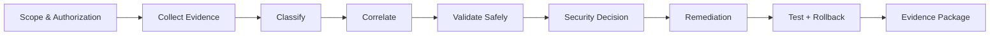

<div align="center">

# Gabriel Barbosa — Cybersecurity Engineer

### Cloud Security · Incident Response · DevSecOps · AI Security

**Evidence-first security engineering with reproducible labs and production-safe decision making.**


[Português (Brasil)](README.pt-BR.md) · [Portfolio Index](PORTFOLIO_INDEX.md) · [Methodology](methodology/evidence-first-production-safe.md) · [Security & Confidentiality](SECURITY.md)

</div>

---

## About

I am a **Cybersecurity Engineer at FoundLab**, focused on cloud-native security, incident response, secure delivery pipelines and AI security.

My work is organized around traceable evidence: define scope and authorization, collect telemetry, separate facts from hypotheses, validate safely, implement proportionate controls, and verify remediation.

**Professional-affiliation boundary:** FoundLab is referenced here only as professional context. No case study, lab, architecture, incident, finding, ticket, client, source code, telemetry, identifier or control in this repository represents or reproduces a FoundLab private project or production environment. Public artifacts are independently recreated using synthetic data, controlled laboratories or vendor-neutral reference architectures.

## Author

**Gabriel Barbosa — Cybersecurity Engineer**  
**FoundLab — Cybersecurity Engineer**

**Selected credentials & training:** Offensive Cybersecurity postgraduate studies · Extreme Hacking / Ethical Hacking · AI Red Teaming · Google Cybersecurity Professional · Threat Intelligence Analyst · AI Security & Governance · AWS Security · Digital Forensics.

**Links:** [GitHub Profile](https://github.com/gabrielbdss) · [LinkedIn](https://www.linkedin.com/in/gabriel-b-souza-silva-255397316)

## Portfolio snapshot

| Evidence | Current repository |
|---|---:|
| Security engineering case studies | **6** |
| Hands-on synthetic labs | **5** |
| Runnable local security evaluator | **1** |
| Merge-gate regression tests | **4** |
| External runtime dependencies for the evaluator | **0** |

These numbers describe inspectable artifacts in this repository, not private employer work.

## Reproduce a result

A reviewer can run the DevSecOps Merge Gate locally with no cloud account or external dependency:

```bash
cd labs/04-devsecops-merge-gate
python3 gate.py evidence/positive.json
echo $?   # expected: 0

python3 gate.py evidence/negative.json
echo $?   # expected: 1

python3 gate.py evidence/not-applicable.json
echo $?   # expected: 0

python3 gate.py evidence/unknown.json
echo $?   # expected: 1

python3 -m unittest -v test_gate.py
```

Expected policy behavior: **PASS, FAIL, PASS, FAIL**. `UNKNOWN` fails closed. The automated repository workflow runs the same regression suite on pushes and pull requests.

See the [validation record](labs/04-devsecops-merge-gate/VALIDATION.md) and [source](labs/04-devsecops-merge-gate/gate.py).

## Engineering focus

| Domain | What I demonstrate |
|---|---|
| **Cloud Security** | IAM, workload identity, least privilege, key management, audit logging, serverless security |
| **Incident Response** | triage, timeline reconstruction, telemetry correlation, evidence preservation, containment reasoning |
| **DevSecOps** | CI/CD security gates, dependency risk, branch governance, fail-closed controls, regression validation |
| **AI Security** | AI red teaming, prompt injection, agent/tool trust boundaries, authorization and excessive-agency analysis |
| **Security Governance** | security baselines, threat models, playbooks, evidence packages and remediation planning |

## How I work



**OBSERVED** — directly present in collected evidence.  
**VERIFIED** — independently corroborated.  
**INFERRED** — supported indirectly, but not directly demonstrated.  
**UNVERIFIED** — not demonstrated with available evidence.

## Featured case studies

### 01 · Cloud-Native Incident Response
Evidence preservation, timeline reconstruction, telemetry correlation, competing hypotheses and proportional containment.

[Read the case study →](case-studies/01-cloud-native-incident-response/README.md)

### 02 · Cloud Security Baseline & Least Privilege
Effective access, workload identity, cryptographic boundaries, data permissions and remediation with validation and rollback.

[Read the case study →](case-studies/02-cloud-security-baseline/README.md)

### 03 · Deterministic DevSecOps Merge Gate
Deterministic CI/CD security decisions, bounded states, negative testing and fail-closed governance.

[Read the case study →](case-studies/03-devsecops-merge-gate/README.md)

### 04 · AI Security & Red Teaming
Prompt injection, excessive agency, retrieval boundaries, tool authorization and explicit AI security invariants.

[Read the case study →](case-studies/04-ai-security-red-teaming/README.md)

### 05 · Security Incident Response Playbook
Evidence preservation, escalation, proportional containment, recovery validation and tabletop exercises.

[Read the playbook →](case-studies/05-incident-response-playbook/README.md)

### 06 · Dependency Vulnerability Triage
Dependency presence, advisory applicability, reachability reasoning and remediation validation without overstating exploitability.

[Read the case study →](case-studies/06-dependency-vulnerability-triage/README.md)

## Hands-on security labs

| Lab | Demonstrates | Artifacts |
|---|---|---|
| [01 · Cloud Incident Triage](labs/01-cloud-incident-triage/README.md) | evidence-driven incident analysis | synthetic request, application and audit telemetry |
| [02 · Cloud Least Privilege](labs/02-cloud-least-privilege/README.md) | effective-access review | permissions, workload requirements, remediation plan |
| [03 · AI Tool Authorization](labs/03-ai-tool-authorization/README.md) | independent authorization boundary | adversarial test vector and policy evidence |
| [04 · DevSecOps Merge Gate](labs/04-devsecops-merge-gate/README.md) | deterministic fail-closed CI logic | runnable Python evaluator, fixtures and regression tests |
| [05 · Dependency Triage](labs/05-dependency-triage/README.md) | vulnerability reconciliation | scanner, dependency-path and reachability evidence |

## Core engineering principles

- **Evidence before mutation.**
- **Production is evidence, not a laboratory.**
- **Claims require evidence.**
- **Least privilege by default.**
- **Severity and confidence are separate dimensions.**
- **Unknown is an acceptable conclusion.**
- **Remediation requires validation and rollback.**
- **Model or agent output is not authorization.**

## Repository map

```text
.
├── .github/workflows/ # Automated portfolio validation
├── case-studies/      # Vendor-neutral security engineering cases
├── labs/              # Reproducible synthetic exercises
├── methodology/       # Evidence First / Production Safe
├── templates/         # Reusable security documentation
├── PORTFOLIO_INDEX.md # Role-oriented navigation
├── GLOSSARY.md        # Shared security terminology
└── SECURITY.md        # Publication & confidentiality policy
```

## Confidentiality by design

The public portfolio may identify an authorized professional affiliation, but it does **not** publish private projects, client identities, production identifiers, credentials, raw operational logs, internal tickets, proprietary source code, non-public architecture or unresolved private findings.

Real-world experience may inform the engineering discipline represented here; the public implementations themselves are **synthetic, controlled or vendor-neutral** and are not copies of employer systems.

See [SECURITY.md](SECURITY.md) for the publication standard.

## Explore

For a shorter route through the material, use the [Portfolio Index](PORTFOLIO_INDEX.md). For terminology, see the [Security Engineering Glossary](GLOSSARY.md). Technical corrections and constructive review are welcome under [CONTRIBUTING.md](CONTRIBUTING.md).

---

<div align="center">

**Gabriel Barbosa · Cybersecurity Engineer**  
**FoundLab**

Cloud Security · Incident Response · DevSecOps · AI Security

</div>
