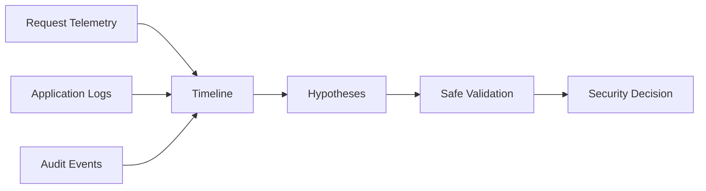

# Case Study 01 — Cloud-Native Incident Response

> **Sanitized reference case.** Evidence and identifiers are synthetic.

## Scenario

A cloud-hosted API records an unusual request close to an application failure. The objective is to determine what the evidence supports without treating unfamiliar activity as proof of compromise.

## Investigation model

## Evidence matrix

| Evidence | State | Interpretation |
|---|---|---|
| unusual request exists | OBSERVED | event occurred |
| authorization denial | VERIFIED | protected action was denied in supplied evidence |
| correlated application failure | OBSERVED | error occurred near the event |
| credential compromise | UNVERIFIED | not demonstrated |
| data exfiltration | UNVERIFIED | not demonstrated |

## Investigation sequence

Preserve telemetry; normalize timestamps; correlate identifiers; separate observations from hypotheses; search for privilege, credential and data-access evidence; choose the least invasive validation; contain only when evidence and impact justify it.

## Result

An unusual request and correlated security/application events can be demonstrated. **Compromise or exfiltration cannot be claimed without additional evidence.**

## Engineering lesson

**Unknown is acceptable. Unsupported certainty is not.**

## Confidentiality

No employer/client identity, real endpoint, operational IP, private ticket, production identifier or raw private log is included.
