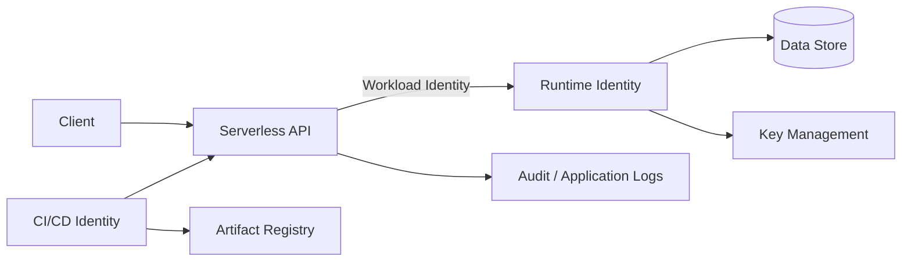
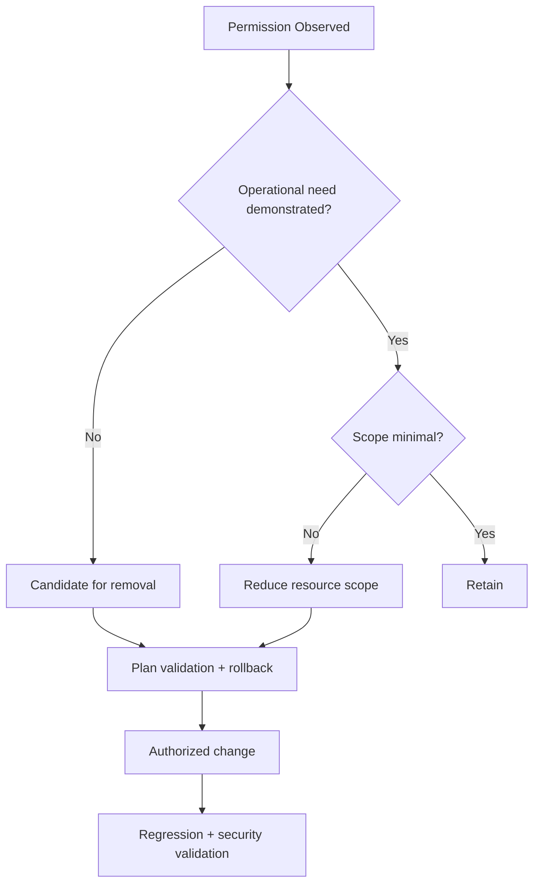

# Case Study 02 — Cloud Security Baseline & Least Privilege

> **Controlled reference case.** The architecture, identities and evidence examples in this case are synthetic. They demonstrate a repeatable assessment method and do not reproduce a private production environment.

## Objective

Establish a defensible cloud-security baseline before proposing changes. The assessment focuses on effective access, workload identity, cryptographic key use, data permissions, exposure boundaries and observability.

The key question is not simply **“what roles exist?”** but:

> **What can this workload effectively do, at which scope, why does it need those permissions, and what evidence demonstrates that need?**

## Reference architecture

## Assessment domains

| Domain | Question | Evidence |
|---|---|---|
| Workload identity | Which identity executes the workload? | service configuration |
| IAM | Which permissions are effective and at what scope? | IAM policies and resource bindings |
| Key management | Which cryptographic operations are required? | key policy + application behavior |
| Data access | Can the workload mutate or delete protected data? | effective permissions + controlled tests |
| Exposure | Who can reach or invoke the service? | ingress/auth configuration |
| Supply chain | What artifact is actually deployed? | immutable digest / deployment metadata |
| Observability | Can security-relevant actions be reconstructed? | audit and application telemetry |

## Evidence-first sequence

1. Establish account, project/subscription and workload scope.
2. Record the deployed workload identity and immutable artifact reference.
3. Inventory project-level and resource-level access.
4. Calculate effective permissions rather than relying on role names alone.
5. Map each sensitive permission to an observed workload requirement.
6. Separate documented design from implemented and observed behavior.
7. Identify excessive scope, redundant grants and unproven claims.
8. Prepare a least-privilege change plan with rollback.
9. Validate in a controlled environment before authorized production mutation.

## Example effective-access matrix

Synthetic example:

| Capability | Granted scope | Required scope | Assessment |
|---|---|---|---|
| Read application records | dataset | dataset | justified |
| Append audit records | dataset | table | scope reduction candidate |
| Delete audit records | dataset | none demonstrated | excessive until proven necessary |
| Use signing key | project | single key | scope reduction candidate |
| Deploy workload | CI identity | service | separate deployment trust boundary |

A broad role is not automatically a vulnerability. The finding emerges when **effective capability exceeds demonstrated operational need** and the excess creates a meaningful attack or failure path.

## Least-privilege decision model

## Claims that require proof

Examples of statements that should not be accepted from documentation alone:

- “the audit trail is immutable”;
- “the workload has least privilege”;
- “the key is restricted to this service”;
- “only authenticated callers can invoke the API”;
- “the deployed artifact matches the reviewed source.”

Each claim requires evidence from the relevant control plane, data plane or controlled validation.

## Remediation package

A production-ready recommendation should include:

- current effective access;
- proposed target access;
- reason for each removed or retained capability;
- affected trust boundary;
- expected application behavior;
- validation procedure;
- rollback condition and rollback procedure;
- residual risk.

## What this demonstrates

**Cloud IAM analysis · workload identity · least privilege · key-management reasoning · data-protection assessment · serverless security · supply-chain verification · production-safe remediation planning**

## Confidentiality note

This case intentionally uses a generic reference architecture and synthetic permissions. It demonstrates the assessment method without exposing a real organization or environment.
