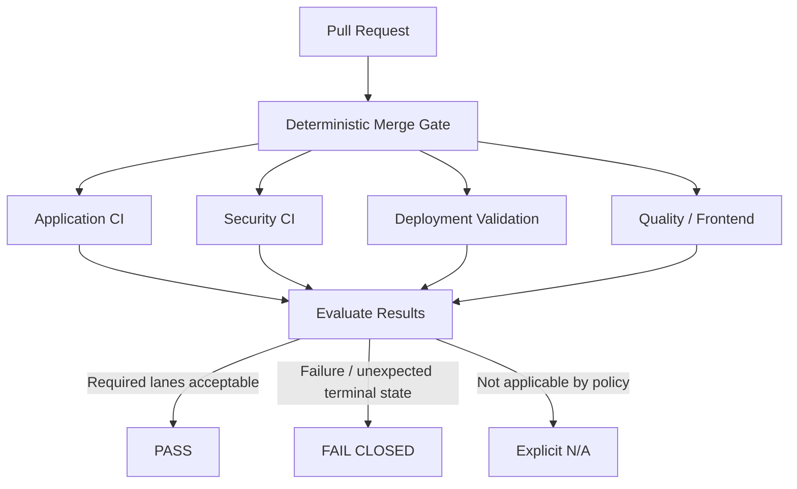

# Case Study 03 — Deterministic DevSecOps Merge Gate

> **Laboratory design.** This case demonstrates CI/CD security governance using generic workflows and synthetic test conditions.

## Problem

A repository can contain multiple CI workflows while still lacking one deterministic answer to a critical merge question:

> **Did every security-relevant lane required for this change reach an acceptable state?**

Individual checks may be skipped by path filters, renamed, delayed or executed under different conditions. A branch rule that depends on an inconsistent set of checks can create ambiguous merge behavior.

## Security objective

Create one stable, auditable merge decision that:

- runs for every pull request targeting the protected branch;
- understands which downstream lanes are applicable;
- waits only for a bounded period;
- treats unexpected or failed states conservatively;
- supports both positive and negative tests;
- produces a single status suitable for branch governance.

## Reference flow



## Threat model

| Failure mode | Security concern |
|---|---|
| Required workflow silently skipped | change may merge without intended validation |
| Check renamed or removed | branch policy may no longer represent the intended control |
| Infinite polling | CI resource exhaustion / blocked delivery |
| Failure treated as success | unsafe change can pass governance |
| N/A indistinguishable from skipped | missing control can be misclassified |
| Gate tests only the happy path | fail-closed behavior remains unproven |

## Deterministic state model

A useful gate normalizes downstream results into a small policy vocabulary:

```text
PASS      = required lane completed successfully
FAIL      = required lane completed unsuccessfully
N/A       = policy explicitly determined lane does not apply
PENDING   = lane is still legitimately running
UNKNOWN   = unexpected state; do not silently accept
```

The policy decision should be deterministic for the same set of inputs.

## Bounded polling

When downstream jobs complete asynchronously, the gate should not wait forever.

Conceptually:

```text
deadline = start_time + MAX_WAIT

while now < deadline:
    states = collect_required_lane_states()

    if any terminal failure or unknown terminal state:
        fail

    if all applicable lanes are terminal and acceptable:
        pass

    wait(POLL_INTERVAL)

fail("bounded wait exceeded")
```

This is pseudocode, not a production workflow.

## Validation strategy

### Positive test
Create a controlled change where every applicable lane succeeds.

Expected result: **merge gate = PASS**.

### Negative test
Create a controlled condition that causes one required lane to fail.

Expected result: **merge gate = FAIL**, even when other lanes succeed.

### N/A test
Create a change for which a lane is explicitly non-applicable according to policy.

Expected result: **N/A is recorded intentionally**, rather than inferred from an unexplained skip.

## Evidence package

A defensible implementation should preserve:

- pull-request identifier from the laboratory;
- gate run identifier;
- normalized lane states;
- positive-test result;
- negative-test result;
- policy version;
- explanation for N/A decisions.

## What this demonstrates

**DevSecOps · CI/CD governance · branch protection reasoning · fail-closed design · negative testing · deterministic controls · security evidence**

## Engineering lesson

A green workflow icon is not the control objective. The control objective is a **predictable security decision whose inputs, exceptions and failure behavior can be explained and reproduced**.

## Confidentiality note

No private repository, organization, workflow name, internal pull request or production CI configuration is reproduced here.
