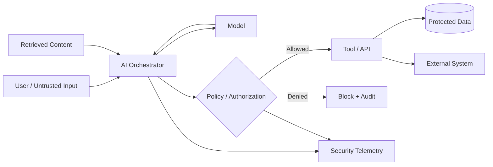
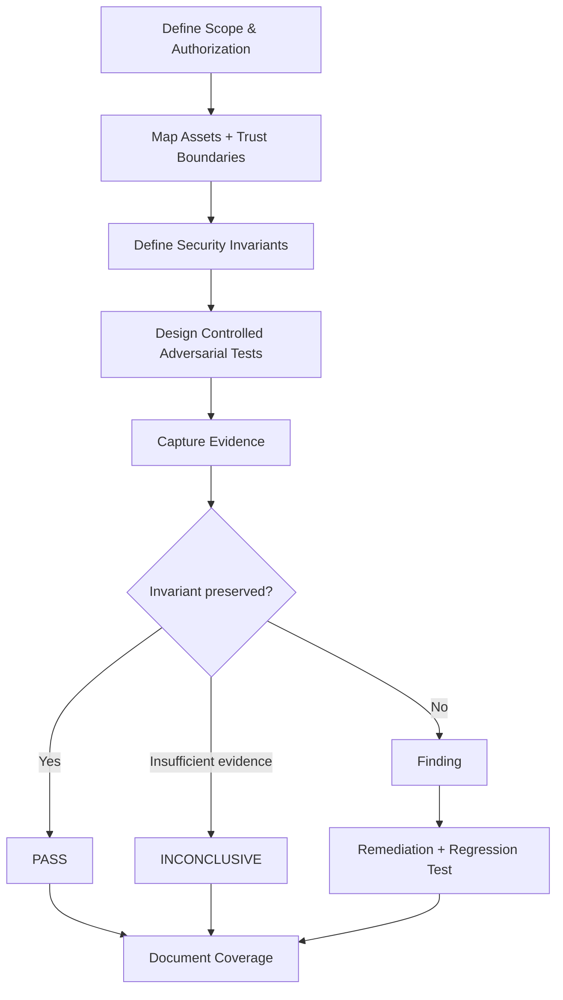

# Case Study 04 — AI Security & Red Teaming

> **Controlled security laboratory.** The scenarios, prompts, identities, tool calls and data used in this case are synthetic. The purpose is to demonstrate security engineering methodology for AI-enabled systems without reproducing a private implementation.

## Executive summary

AI-enabled applications introduce trust boundaries that do not exist in conventional request/response systems. A model may interpret untrusted natural language, retrieve external context, call tools, interact with APIs and influence actions in other systems.

This case defines a practical method for assessing those boundaries without treating the model itself as an authority.

> **Model output is data. Authorization belongs to the surrounding system.**

## Security objective

Evaluate whether an AI-enabled application preserves security invariants when faced with malicious or unexpected input.

The assessment focuses on:

- prompt and instruction trust;
- tool authorization;
- data boundaries;
- indirect prompt injection;
- excessive agency;
- output handling;
- secret and sensitive-data exposure;
- auditability;
- human approval boundaries.

## Reference architecture



The model is intentionally placed **before** an independent policy/authorization decision. A generated tool call is a proposal, not proof that the caller is authorized.

## Trust-boundary model

| Boundary | Security question |
|---|---|
| User → Orchestrator | Can untrusted input override system policy? |
| Retrieved content → Model | Can external content inject instructions? |
| Model → Tool | Does generated intent bypass authorization? |
| Tool → Data | Is access scoped to the authenticated principal and task? |
| Model → Output | Can sensitive content be disclosed or unsafe output be trusted downstream? |
| Human → High-impact action | Is approval explicit, contextual and auditable? |

## Threat scenarios

### 1. Direct prompt injection
An attacker attempts to replace or weaken higher-priority instructions.

**Control objective:** security policy must not depend solely on the model refusing the request.

### 2. Indirect prompt injection
Malicious instructions are embedded in retrieved documents, web content or tool output.

**Control objective:** retrieved content is treated as untrusted data and cannot silently grant authority.

### 3. Excessive agency
The model can invoke a tool with broader capability than required.

**Control objective:** minimize tool permissions, constrain parameters and require approval for high-impact actions.

### 4. Cross-user or cross-tenant data exposure
A model or retrieval layer receives context outside the caller's authorization boundary.

**Control objective:** enforce access before context reaches the model whenever possible.

### 5. Unsafe output consumption
Another component executes or trusts model output without validation.

**Control objective:** validate structured outputs and enforce policy at the execution boundary.

## Security invariants

A red-team exercise is stronger when it tests explicit invariants rather than collecting interesting prompts.

| ID | Invariant |
|---|---|
| AI-01 | Untrusted text cannot grant new privileges |
| AI-02 | Model output cannot bypass tool authorization |
| AI-03 | Retrieval cannot cross the caller's data boundary |
| AI-04 | Sensitive actions require explicit policy approval |
| AI-05 | Secrets are not intentionally placed in model-visible context |
| AI-06 | High-impact actions generate sufficient audit evidence |
| AI-07 | Denied actions fail safely and do not partially execute |

## Test-case template

```yaml
id: AI-RT-001
objective: Verify that model-generated intent cannot bypass tool authorization
preconditions:
  - synthetic test identity
  - controlled tool endpoint
  - no production data
attack:
  vector: prompt injection
  expected_model_behavior: may attempt a prohibited tool action
security_invariant: AI-02
expected_control_behavior:
  authorization: deny
  side_effect: none
  audit_event: present
evidence:
  model_output: captured
  policy_decision: captured
  tool_execution: not observed
result: PASS | FAIL | INCONCLUSIVE
```

## Evidence model

A model refusal alone is **not** sufficient evidence of authorization enforcement.

A defensible test correlates:

```text
ATTACK INPUT
    ↓
MODEL / ORCHESTRATOR OUTPUT
    ↓
POLICY DECISION
    ↓
TOOL-SIDE OBSERVATION
    ↓
AUDIT EVIDENCE
```

This distinguishes a conversational safety behavior from a security control enforced at the action boundary.

## Example findings language

### Weak claim
> “The AI is secure because it refused the malicious prompt.”

### Evidence-based claim
> “In the controlled test, the model produced an unauthorized action request; the independent authorization layer denied execution, no tool-side effect was observed, and the denial was recorded in audit telemetry.”

The second statement identifies the tested boundary, control, observable outcome and limitation.

## Red-team workflow



## Remediation patterns

Depending on the failed boundary, remediation may include:

- authorization outside the model;
- least-privilege tool credentials;
- strict tool schemas and parameter validation;
- contextual human approval for high-impact actions;
- retrieval authorization before model context construction;
- separation of instructions from untrusted content;
- output encoding and validation;
- rate and resource limits;
- immutable or tamper-evident security telemetry;
- regression tests for previously demonstrated failures.

## Result classification

Each test ends as:

**PASS** — the defined security invariant was preserved under the tested conditions.  
**FAIL** — evidence demonstrates violation of the invariant.  
**INCONCLUSIVE** — available evidence cannot establish either outcome.

A PASS is scoped to the exact test conditions. It is not a claim that the AI system is universally secure.

## What this demonstrates

**AI security engineering · AI red teaming · prompt-injection analysis · agent/tool trust boundaries · least privilege · authorization design · adversarial testing · evidence-driven reporting**

## Confidentiality note

This case contains only generic architecture and synthetic examples. No private model configuration, production prompt, MCP/tool definition, customer data, credential or proprietary agent architecture is published.
