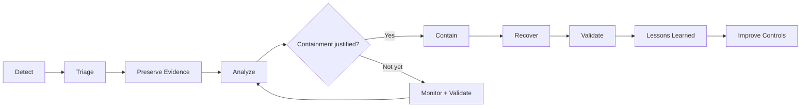
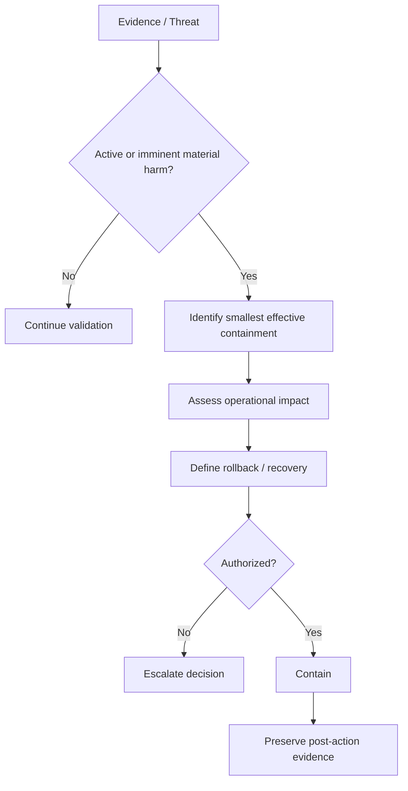

# Case Study 05 — Security Incident Response Playbook

> **Vendor-neutral operational reference.** This case presents a reusable incident-response operating model. Names, systems, contacts, commands and evidence examples are generic or synthetic.

## Executive summary

An incident-response playbook should reduce uncertainty under pressure. Its purpose is not to predict every incident, but to establish **decision authority, evidence discipline, escalation paths, containment criteria and recovery gates** before they are needed.

This case translates those principles into a compact operational model suitable for cloud-native and AI-enabled environments.

## Operating principles

> **Evidence before mutation.**  
> **Containment proportional to evidence and impact.**  
> **Severity is not confidence.**  
> **Unknown is an acceptable state.**  
> **Production is not a laboratory.**  
> **Model or agent proposals are not authority.**

## Incident lifecycle



## Roles and decision boundaries

| Function | Responsibility |
|---|---|
| Incident Lead | coordinates response, priorities and decision record |
| Security Engineering | evidence collection, technical analysis, hypotheses and recommendations |
| Infrastructure / Service Owner | validates operational impact and executes authorized infrastructure changes |
| Business / Executive Authority | accepts material business risk and high-impact containment decisions |
| Legal / Privacy | engaged when applicable obligations or regulated data may be involved |

One person may perform multiple functions in a small organization, but the **decision boundary should remain explicit**.

## Severity vs. confidence

Severity answers: **How bad could the demonstrated or credible impact be?**

Confidence answers: **How strong is the evidence supporting the conclusion?**

| Example | Severity | Confidence | Response |
|---|---:|---:|---|
| Confirmed privileged credential misuse | Critical | High | immediate authorized containment |
| Suspicious request with limited context | Medium/High potential | Low | preserve, correlate, validate |
| Failed unauthorized request with no corroborating activity | Low/Medium | Medium | document, monitor, improve detection |

A high potential impact does not transform weak evidence into confirmed compromise.

## Initial triage

Within the first response cycle, establish:

1. **What triggered the investigation?**
2. **What is the time window?**
3. **Which assets and trust boundaries may be affected?**
4. **What evidence is volatile?**
5. **Is harmful activity currently ongoing?**
6. **Which actions require explicit authorization?**
7. **What must not be changed before evidence is preserved?**

## Evidence preservation

Prioritize read-only collection of:

- request and application telemetry;
- identity and authentication events;
- control-plane audit events;
- data-access events when available;
- deployment and artifact metadata;
- relevant configuration state;
- security alerts and correlated timestamps.

Record time zones and normalize the investigation timeline, preferably to UTC.

## Evidence register

| ID | Timestamp | Source | Observation | State | Integrity / notes |
|---|---|---|---|---|---|
| EV-001 | synthetic | request telemetry | example observation | OBSERVED | laboratory example |

Evidence should remain distinguishable from interpretation.

## Hypothesis board

For every plausible scenario, capture evidence **for** and **against** it.

| Hypothesis | Supporting evidence | Disconfirming evidence | State |
|---|---|---|---|
| Credential compromise | — | — | UNVERIFIED |
| Application failure | — | — | UNVERIFIED |
| Unauthorized data access | — | — | UNVERIFIED |

The purpose is to resist confirmation bias and make uncertainty visible.

## Containment decision gate



Potential containment actions may include credential revocation, access restriction, traffic controls, workload isolation or deployment rollback. **This playbook intentionally does not prescribe production commands** because implementation depends on the environment and authorization.

## Escalation triggers

Escalate when evidence indicates or credibly suggests:

- privileged identity compromise;
- active persistence;
- material data exposure or exfiltration;
- destructive activity;
- compromise of CI/CD or software supply chain;
- cryptographic key compromise;
- cross-tenant impact;
- safety or regulatory implications;
- inability to bound the affected environment.

## Recovery gate

Recovery is not merely “service is online.”

Before closure, validate:

- malicious or unsafe activity is no longer observed;
- affected credentials/control paths have been addressed when required;
- expected service behavior is restored;
- security telemetry remains available;
- remediation did not introduce a new critical failure;
- residual risk and unresolved questions are documented.

## Incident record

A concise final record should contain:

```text
Incident:
Scope:
Trigger:
Timeline:
Affected assets:
Evidence:
Confirmed facts:
Unverified hypotheses:
Containment:
Recovery:
Residual risk:
Lessons learned:
Follow-up controls:
Decision owners:
```

## Tabletop validation

A playbook is not operationally mature merely because it exists. Validate it with a tabletop exercise.

Example scenario:

> A cloud-hosted service produces an unusual authenticated request followed by an application error and a security alert.

The exercise should test:

- who becomes Incident Lead;
- which evidence is collected first;
- whether mutation occurs before preservation;
- how severity and confidence are recorded;
- who can authorize containment;
- how rollback is planned;
- what evidence is required to close the incident.

## What this demonstrates

**Incident response engineering · evidence preservation · escalation design · containment governance · cloud response · recovery validation · tabletop planning · security operations documentation**

## Confidentiality note

This playbook is intentionally vendor-neutral and contains no private contacts, organization names, production commands, credentials, infrastructure identifiers or internal escalation data.
