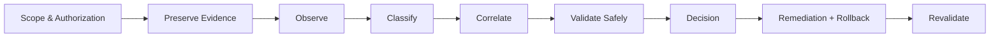

# Evidence First / Production Safe

## Core rule

**Preserve and understand before changing. Production is a source of evidence, not a laboratory.**

## Evidence states

| State | Meaning |
|---|---|
| **OBSERVED** | directly present in collected evidence |
| **VERIFIED** | independently corroborated |
| **INFERRED** | supported indirectly, not directly demonstrated |
| **UNVERIFIED** | not demonstrated with available evidence |

## Production-safe hierarchy

Prefer read-only observation, local analysis, controlled laboratory validation, staging validation, then explicitly authorized production-safe action. Mutating or destructive actions require clear authorization, impact analysis and rollback.

## Decision discipline

Documentation, source code, test results and observed production behavior are different evidence layers. One must not be silently substituted for another. Severity and confidence are separate dimensions.

## Reporting standard

A defensible conclusion states scope, evidence, classification, limitations, decision and the next safe validation step.
