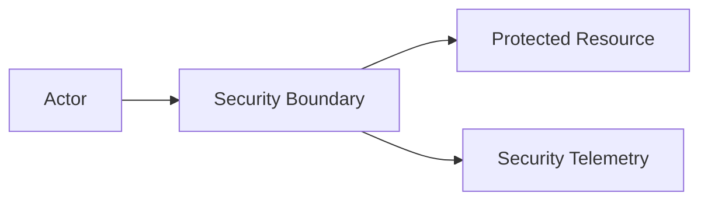

# Security Case Study Template

> **Publication classification:** Public / Sanitized / Synthetic / Laboratory  
> Replace this line with the correct classification before publishing.

## Executive summary

Describe the security problem in a few sentences. State what was assessed, why it mattered and the defensible outcome. Do not reveal confidential infrastructure or imply that a laboratory result proves production behavior.

## 1. Objective

State the security question in measurable terms.

## 2. Scope & authorization

**In scope:** systems, components, trust boundaries and evidence sources intentionally assessed.

**Out of scope:** destructive testing, unrelated systems, production mutation or any action not explicitly authorized.

## 3. Reference architecture

Use a generic or laboratory architecture.



## 4. Threat model

| Threat / failure mode | Security objective | Evidence required |
|---|---|---|
| Example threat | Expected control | Evidence that can prove or disprove it |

## 5. Security invariants

Define what must remain true.

- **INV-01:** Example invariant.
- **INV-02:** Example invariant.

## 6. Evidence plan

| Evidence source | Purpose | Collection mode |
|---|---|---|
| Example telemetry | Validate behavior | Read-only |

Distinguish intended design, implemented code, tested behavior and observed production behavior.

## 7. Test procedure

For each test document:

```text
Test ID:
Objective:
Preconditions:
Action:
Expected control:
Expected evidence:
Safety boundary:
Result:
```

## 8. Findings

For each finding record:

| Field | Content |
|---|---|
| Title | Concise security issue |
| Severity | Impact-oriented rating |
| Confidence | Confidence in the evidence |
| Evidence state | OBSERVED / VERIFIED / INFERRED / UNVERIFIED |
| Affected boundary | Component or trust boundary |
| Evidence | Sanitized evidence reference |
| Impact | What can happen |
| Recommendation | Smallest effective remediation |
| Validation | How the fix will be proven |
| Rollback | How change can be safely reversed |

## 9. Result & limitations

State what the evidence supports and what it does **not** support. “Insufficient evidence” is a valid outcome.

## 10. Remediation & validation

Describe the target control, prerequisites, authorization required, validation steps and rollback conditions.

## 11. Lessons learned

Capture the engineering lesson rather than only the vulnerability.

## 12. Confidentiality review

Before publication verify that the artifact contains no private organization/client identity, production identifier, raw operational log, credential, unresolved private finding, proprietary code or reconstructable internal architecture.

---

**Evidence First · Production Safe · Security by Design**
